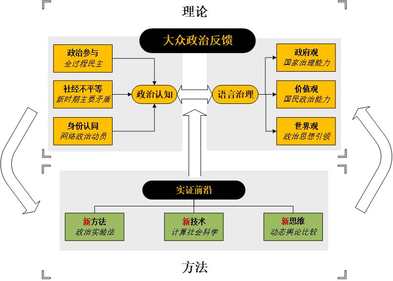
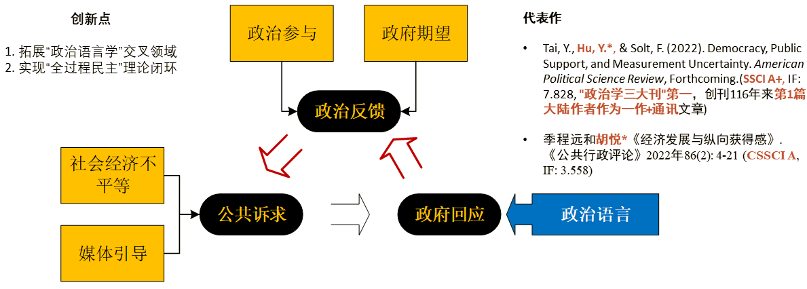
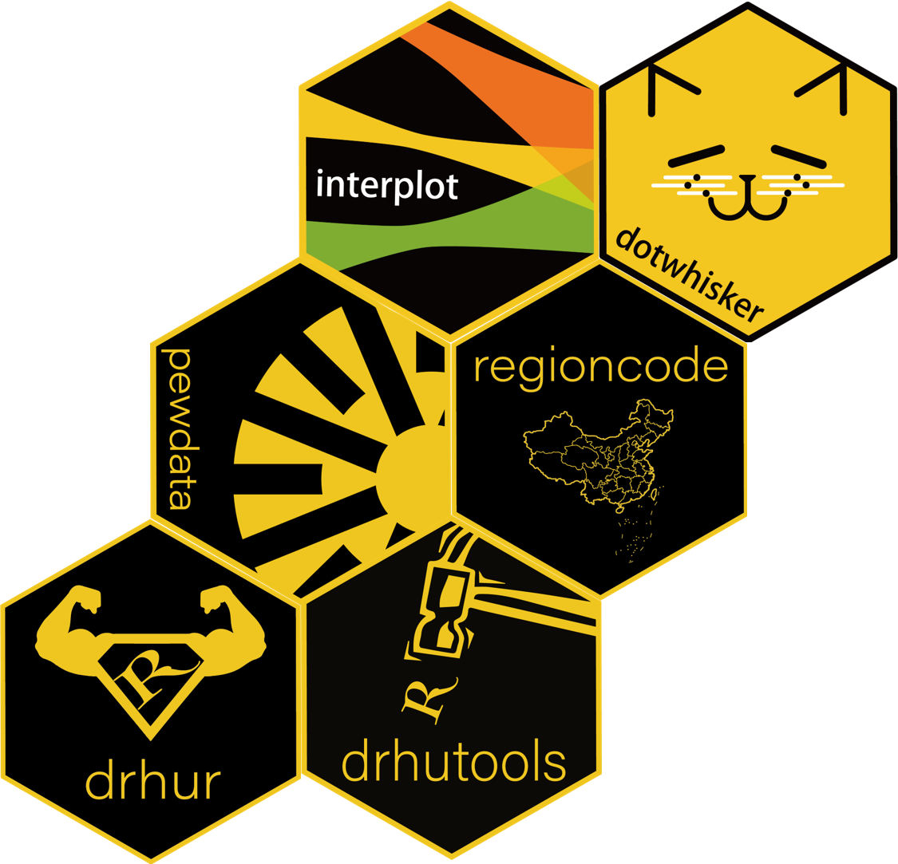
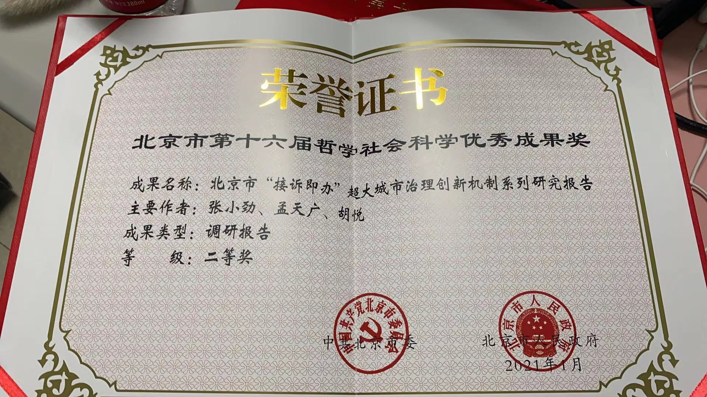
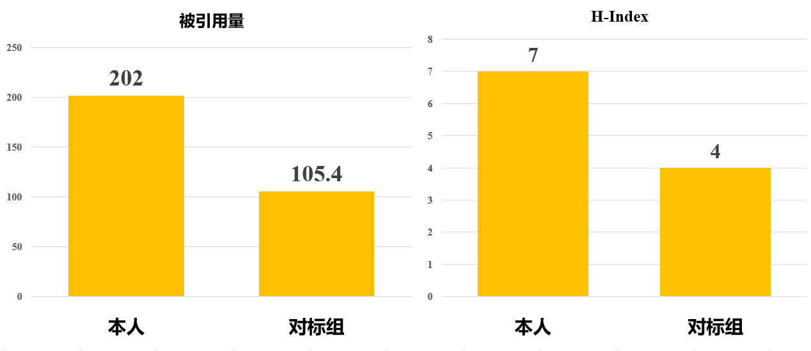
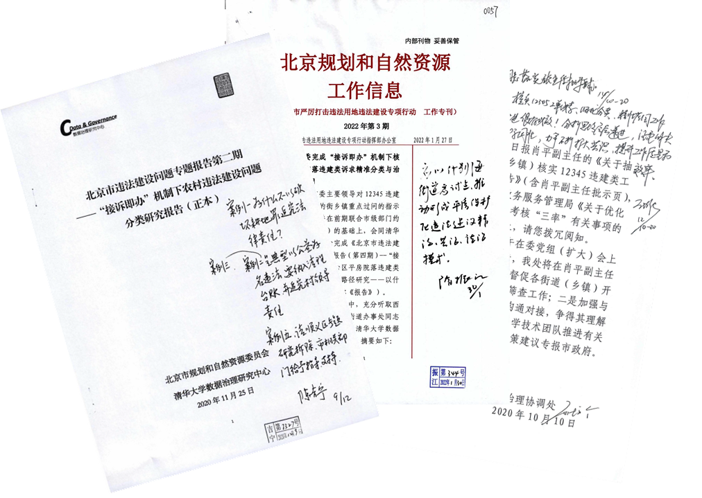
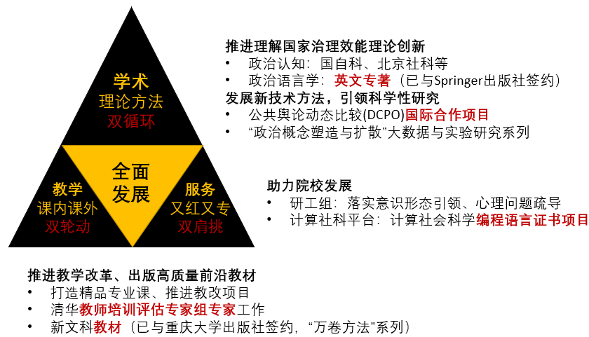

```{r setup, include=FALSE}
knitr::opts_chunk$set(echo = FALSE, message = FALSE, warning = FALSE)

if (!require(pacman)) install.packages("pacman")
library(pacman)

p_load(
  dplyr,flextable
) # data wrangling # data wrangling

xaringanExtra::use_xaringan_extra(c("tile_view", # O
                                    "broadcast", 
                                    "panelset",
                                    "tachyons"))

# Functions preload
set.seed(313)
```

## 个人简介

*学术经历*

- **2021-今：清华大学社会科学学院&nbsp; &nbsp;副教授**
- 2019-2021：清华大学社会科学学院政治系&nbsp; &nbsp;助理教授<br><br>
- 2013-2018：美国爱荷华大学&nbsp;&nbsp;政治学博士
- 2011-2013：美国南卡罗莱纳大学&nbsp;&nbsp;政治学硕士
- 2009-2011：加拿大里贾纳大学&nbsp;&nbsp;政治学硕士
- 2005-2009：南开大学&nbsp;&nbsp;国际政治学士

*学术兼职*

- **2021-今：清华大学计算社会科学平台&nbsp;&nbsp;副主任**
- 2021-今：清华大学苏世民学院&nbsp;&nbsp;论文导师
- 2020-今：上海交通大学中国发展研究院&nbsp;&nbsp;“流动的中国”网络研究员
- 2019-今：清华大学数据治理研究中心&nbsp;&nbsp;副主任


???

评委老师们好，我是社科学院的胡悦。很高兴有这个机会能向诸位老师汇报我目前的工作和发展情况！
我自2019年加入清华社科学院，现任政治系副教授，同时兼任清华计算社会科学平台副主任等职。

---

## 研究内容：理论-方法“双螺旋”

.center[**基于政治心理和政治文化的政治反馈理论与实证研究**]


.center[]

???

下面简要介绍一下我的研究内容，分为理论和方法两个方向。在理论上，我结合民众的政治认知塑造和国家的语言治理提出了大众反馈理论，用以理解政治系统与个体关系的经典政治学问题，并回应了全过程民主、国家治理能力等重要政治学话题。同时我推动前沿实证方法发展和应用，用新方法、新技术和新思维来解答政治学核心问题，也通过解答过程推动科学方法发展，形成理论内部互动，理论-方法相互促进的双螺旋促进机制。


---

## 学术成果

.center[总共发表.red[**22**]篇，SSCI前25%文章7 篇.red[**(顶刊2篇)**]] 

**独立性**：入职以来论文.red[**100%**]为一作/通讯，.red[**三分之一**]为独立作者。    
**创新型**：国际顶刊发表高水平论文
.center[
- 学科三大顶刊已发.red[**其二**]
- 国际政治学首刊 (*APSR*) .red[**第一位**]大陆（共同）一作+通讯
- 政治心理顶尖刊物（*Political Psychology*）.red[**第二篇**]大陆学者独作
]

.small[
| 作者                                     	| 发表时间 	| 期刊                              	| 质量                         	| 大陆一作/通讯                      	|
|------------------------------------------	|----------	|-----------------------------------	|------------------------------	|-------------------------------	|
| Tai, Y., **Hu, Y.\***, & Solt, F. 	| 2022     	| American Political Science Review<br>(创刊于1906年，约56篇/年)	| .red[**SSCI A+**]<br>IF: 7.828 	| &nbsp;&nbsp;&nbsp;&nbsp;.red[**第1篇**]（共1篇）            	|
| **Hu, Y.\***                    	| 2020     	| Political Psychology<br>(创刊于1980年，约71篇/年)              	| .red[**SSCI A+**]<br>IF: 4.333 	| &nbsp;&nbsp;&nbsp;&nbsp;第3篇<br>(共3篇，.red[**独作第2**]) 	|

]

???

目前发表论文22篇，包含多篇A+类文章，两篇发在学科顶刊。我的学术发表有两个特点：一个是独立性高，入职以来发表论文全部为一作和通讯，三分之一为独立作品；另一个特点是创新性强，是数个国际期刊创刊以来前十的大陆一作和通讯，今年特别高兴的是成为了首位大陆学者，作为共一和通讯，在政治学国际首刊上发表论文。政治学国际期刊一向有着不只是学术要求高，还有意识形态方面的壁垒，这次发文也算是在国际发声一次突破。

---

class: small

## 学术贡献I: 大众政治反馈理论

.center[]

.pull-left[
**代表作**
- Solt, F., .red[**Hu, Y.**], Hudson, K., Song, J., & Yu, D. “Erico.” (2017). Economic Inequality and Class Consciousness. *The Journal of Politics*, 79(3), 1079–1083. (.red[**SSCI A+**], IF: 3.458，.red[**"政治学三大刊"第三**]，创刊54年来.red[**第2篇大陆学者发表文章**])
- Jiang, Q., Liu, S., Hu, Y., & Xu, J. (2022). Social Media for Health Campaign and Solidarity Among Chinses Fandom Publics During the Covid-19 Pandemic. Frontiers in Psychology: Health Psychology, 12, 824377.(.red[**SCI/SSCI A**], IF 2.988)

]

.pull-right[
**代表作**    
- .red[**Hu, Y.\\***] (2020). Culture Marker Versus Authority Marker: How Do Language Attitudes Affect Political Trust? *Political Psychology*, 41(4), 699–716. (.red[**SSCI A+**], IF: 4.333，.red[**政治心理学顶刊**]，创刊42年来.red[**第2篇大陆学者独作文章**])
- Tang, W., .red[**Hu, Y.**], & Jin, S.* (2016). Affirmative Inaction: Language Education and Labor Mobility among China’s Muslim Minorities. *Chinese Sociological Review*, 48(4), 346–366. (SSCI A+, IF: 2.097)
]

???

下面做一点更为细致的介绍。首先在大众反馈理论方面，我除了对公共诉求建构以及政府治理的语言特征进行研究外，特别提出了“回应之回应”理论模型，构成了政府回应民众进行治理，民众根据政府治理调整诉求、再表达的循环模式，补全了现有研究对政府治理之后的环节的缺失，深化全过程民主理论完整度和普适性。相关文章已经发表在数个国际权威期刊和国内核心期刊上。


---

class: small

## 学术贡献II: 前沿实证方法

.pull-left[
**创新点**: 1. 以新方法推进经典议题

- **社会期望偏差**: Tang, W., & .red[**Hu, Y.\\***] (2022). Detecting Grassroots Bribery and its Sources in China: A Survey Experimental Approach. *Journal of Contemporary China*, Forthcoming. (.red[**SSCI A+**], IF: 3.748，.red[**地区研究期刊国际排名第二**])

- **大数据因果推断**: .red[**Hu, Y.**], Sun, Y.\*&,  Lien, D. (2022). The Resistance and Resilience of National Image Building: An Empirical Analysis of Confucius Institute Closures in the U.S. *Chinese Journal of International Politics*, 15(3), Forthcoming. (.red[**SSCI A+**], IF: 3.649)

- **跨时空全文本比较**: .red[**Hu, Y.\\***] (2020). Refocusing Democracy: The Chinese Government’s Framing Strategy in Political Language. *Democratization*, 72(2), 302–320. (.red[**SSCI A**]，IF: 3.055，创刊以来.red[**第4篇大陆学者独作文章**])

- **政治实验方法**：.red[**胡悦\\***]. (2021). 实验室实验：政治科学研究的一种有效方法? 《国外理论动态》, 06, 160–171. (.red[**CSSCI**], IF: 1.109，.red[**人大复印报刊资料转载**])

]

.pull-right[
2\. 以方法软件普惠学术研究

.pull-left[
全球下载量.red[**屡破十万**]：

`dotwhisker`
`interplot`


在.red[**各国别、各领域**]发声

*政治学*

*American Political Science Review*,   
*Journal of Politics*,   
*Comparative Political Studies*,   
*Public Opinion Quarterly*,    
*Policy Studies Journal*,    
*Social Science Quarterly*,
......
]

.pull-right[]


.pull-right[
*心理、法律、环境、神经*

*Journal of Experimental Psychology*,   
*High Court of Justice*,    
*Environmental Pollution*,    
*Neurobiology of Aging*,    
......

*Zeitschrift für Vergleichende Politikwissenschaft*,   
*커뮤니케이션 이론*......
]


]

???

在方法层面，我不仅应用新方法用以解决敏感问题考察、大数据因果推断、跨时空全文本比较等比较政治学和计算社会科学学者普遍困扰问题，还致力于方法论的理论推进，最近发表的一篇文章，出刊四个月就有190次下载，并被最新一期人大复印报刊资料转载。同时，我也致力于将科学方法以软件形式推广给更多学者。右面这个图就是我的软件包矩阵，其中两个全球下载量已经突破10万，每月数千次下载，并不止在政治学，还被心理、法律、环境、神经等各学科重要期刊，甚至非英语期刊引用。


German Journal of Comparative Politics

Communication Theory

---

class: small

## 科研项目

.center[
主持国自科、另作为主要人员参与6项
- .red[**瞄准学科前沿**]：自然科学基金（国家） + 社会科学基金（北京）
- .red[**回应实际挑战**]：高端智库重点专项、人口福利基金会、北京规自委

]

```{r tb-funding}
readxl::read_xlsx("images/funding.xlsx", sheet = "funding") %>% 
  flextable() %>% 
  bold(i = c(1, 2, 3)) %>% 
  autofit()
```

???

在科研项目上，我现在已经主持国自科、北京社科、国家高端智库重点课题等六项研究课题，累积获得研究资助160余万元。

---

class: small

## 学术影响力

.pull-left[


- 人大复印报刊资料转载
- 研究成果获得    
.red[**北京市第十六届哲学社会科学优秀成果二等奖**] 

.center[]
- 国际专家社交媒体视频专荐

.center[]


]

.pull-right[

*对标组（n = 10)*
- **强院校**：第四轮学科评估A+及A学校（北京大学、复旦大学、人民大学）
- **同年龄**：本科毕业2004-2012（本人2009毕业）
- **近领域**：政治心理/政治文化/政治传播



谷歌学术被引用量是对标组约.red[**1.9倍**]，H-index(高引用指数)是对标组约.red[**1.7倍**]；
对比伦敦政经（LSE）Bastow, Dunleavy, Tinkler统计，H-Index已超过.red[**该校正教授**]
]

???

在学术影响力上，我已有两篇文章受到人大复印报刊资料转载，部分成果获得北京市第十六届哲学社会科学优秀成果二等奖。在国际上还受到像Stephan Haggard 这样的著名学者在社交媒体上的视频推荐。另外为了了解和同行的对比情况，我还专门找了第四轮学科评估排在清华政治学之上的四所学校中和我同年龄段且研究领域近似的10名学者进行横向比较。根据谷歌学术，我的国际引用量是对标组的1.9倍，h-index，也就是高引用指数是他们的1.7倍。

---

class: small

## 社会影响力

.pull-left[
运用计算社会科学，协助北京市解决实际治理问题。
主持政府合作项目，获得.red[**国家和市委领导批示**]：

- 《北京市违法建设问题报告第1期——12345违建类诉求分析和治理建议》（2020年10月20日）   
获.red[**北京市副市长**]隋振江肯定性批示

- 《北京市违法建设问题报告第2期——“接诉即办”机制下的农村违法建设问题分类研究报告》(2020年12月10日)    
获.red[**北京市委副书记、市长**]陈吉宁肯定性批示

- 《北京市违法建设问题报告第3期——“接诉即办”机制下违法建设属实工单精准分类与成因诊断研究报告》（2021年8月20日）    
获.red[**中央政治局委员、北京市委书记**]蔡奇肯定性批示

- 《北京市违法建设问题报告第4期——“接诉即办”机制下核心区平房院落违建类诉求精准分类与治理路径研究——以什刹海地区为例》（2022年1月30日）获.red[**北京市副市长**]隋振江肯定性批示。
]


.pull-right[
.center[]
]


???

除学术影响力外，我的一些研究结果的应用价值还得到了政府重视，我牵头课题组，运用计算社会科学方法对北京市治理问题的研究产出，获得了国家领导和北京市领导重视和肯定批示。

---

## 教学情况: 课内课外.red[**“双轮动”**]

.pull-left[
本科生课程：
+ 通识课：《理解政策：多元视角与案例分析》
前.red[**25%**]
+ 专业课:《公共政策分析》

研究生课程：
+ 《政治数据分析》前.red[**25%**]，4项指标前.red[**5%**]
+ 《政务大数据》（合教）

指导学生：

- 博士生3名、硕士生1名 (一名获得.red[**国家奖学金**]，一名获得.red[**教育部港澳及华侨学生奖学金**])   

]

.pull-right[
课外：
- 《R语言工作坊》累计学员.red[**超过3000人**]，包括来自.red[**牛津大学、宾夕法尼亚大学**]等国外高校学生
- 获得.red[**清华大学教学成果奖(二等奖)**]（2021）
- 清华大学研究生社会实践优秀指导教师（2020/2021）

.center[]

]

???

最后再简要汇报一下我的教学和公共服务情况。教学上我不只保持课程和学生指导质量，还创立了R语言工作坊，累计学员超过3000，因此获得清华大学教学成果奖二等奖，以及其他一些教学奖项。

---

## 公共服务：又红又专.red[**“双肩挑”**]

**科研服务**
- .red[**清华计算社会科学平台**]和.red[**清华数据治理中心**]副主任
    - 组织 “大数据社会科学讲习班”、“计算社会科学高端论坛”
- Github Campus Advisor （.red[**全国仅三位，唯一文科教师**]）
- APSR, AJPS, JOP, BJPS等国内外权威期刊审稿人

**院系服务**
- 担当社科党委.red[**研工组组长**]、清华大学校友会社科分会.red[**副秘书长**]，管理研究生.red[**947人**]，领导学生获先进集体、甲级团支部、“一二·九”综奖三连冠等。
- 完成建立.red[**3**]个暑期实践基地、.red[**1**]个就业实践基地及配套奖助学金。
- 获得.red[**清华大学毕业生就业工作先进个人**]（2021）


**学校服务**
+ 清华大学“天津招生组”成员，负责首次“强基计划”招生工作。
+ 获得“.red[**清华大学优秀招生新人**]”称号(2020)

???

公共服务方面我响应学校号召，做又红又专的双肩挑青年教师，在科研服务方面担任清华大学计算社会科学平台和数据治理中心副主任，在院内担任党委研工组组长，管理947个研究生日常学习、生活，还积极推进就业、招生工作，获得了学校的嘉奖。

---

## 未来展望: 勉励创新，全面发展

.pull-right[最终目标：“塑造学生品格、品行、品味的‘.red[**大先生**]’” ]


.center[]

???

如前所述，我依照清华对青年学者的培养导向，形成了以学术为重心，兼顾教学、服务的全面发展模式。在未来的工作中，对于每一方面我也都有清晰的计划。无论是在学术上继续推进理论和方法创新，出版我的英文专著、推进国际合作，还是在教学上出版新文科教材、完成邱书记部署的教师培训评估专家组工作，以及在研工组和计算社科平台继续开展工作等等。

邱勇倡议、郑力牵头、袁驷主持

---

class: center, middle

.large[
衷心感谢各位专家    
敬请批评指正！
]

???

以上就是我的报告，衷心感谢各位聆听，敬请批评指正！

```{r pdfPrinting, eval = FALSE, include = FALSE}
pagedown::chrome_print(list.files(pattern = "newStar.html"), 
                       timeout = 500, 
                       box_model = "padding")
```